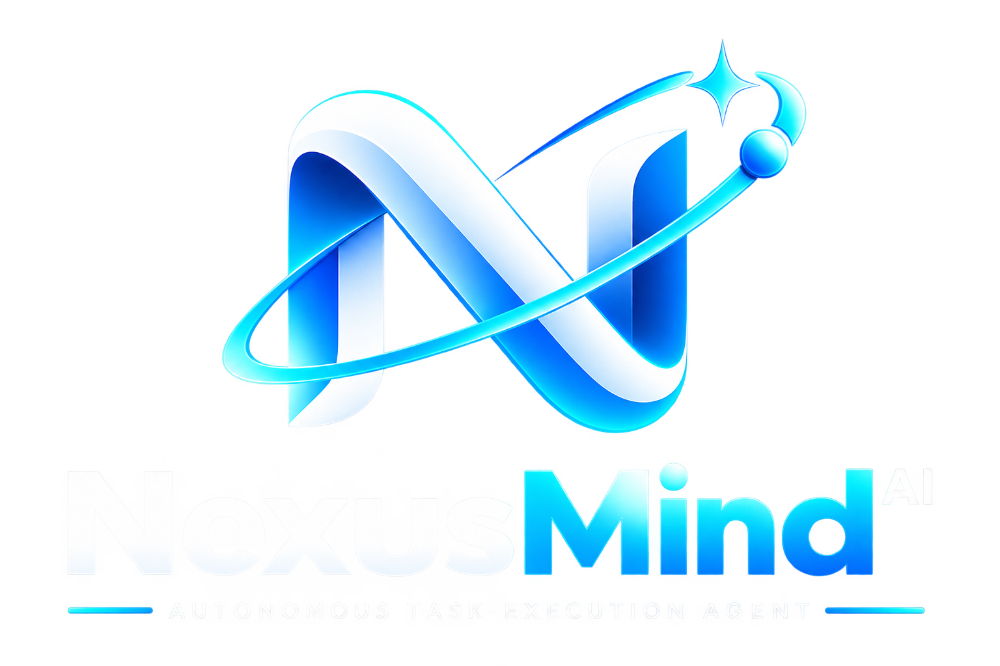

<div align="center">



# NexusMind AI

### Autonomous Task-Execution Agent on Google Cloud

[](https://python.org)
[](https://ai.google.dev)
[](https://cloud.google.com)
[](https://opensource.org/licenses/MIT)
[](#testing)

**Built for the [Google "All Things Agentic" Hackathon](https://allthingsagentic.devpost.com) — Track: The Taskmaster**

</div>

---

## Overview

Most AI today waits for you to ask. **NexusMind AI doesn't.**

It's an autonomous agent that receives goals — via API, webhooks, or a live dashboard — and handles multi-step workflows end-to-end without hand-holding. It plans, executes, self-corrects on failure, asks permission for risky actions, and learns from every task.

### How It Works

```
Goal → Plan → Execute → Self-Correct → Learn → Result
         ↑        ↓
         └── Retry ┘
```

| Step | What Happens |
|------|-------------|
| **1. Plan** | Gemini Flash decomposes the goal into ordered, executable steps |
| **2. Execute** | Tools run in sandboxed environments (web search, code, files, data) |
| **3. Self-Correct** | On failure, Gemini analyzes the error, adjusts parameters, and retries |
| **4. Approve** | High-risk actions (code exec, shell commands) pause for human one-click approval |
| **5. Learn** | Outcomes and reflections are stored for future improvement |
| **6. Trace** | Every reasoning step and tool call is recorded for the live dashboard |

---

## Architecture

```
                    ┌──────────────────────────────┐
                    │   Traceability Dashboard     │
                    │   (Live reasoning chain UI)  │
                    └──────────────┬───────────────┘
                                   │
┌──────────────┐    ┌──────────────▼──────────────┐    ┌──────────────┐
│    GitHub     │───▶│       REST API (FastAPI)     │◀───│    Stripe     │
│   Webhooks   │    │    POST /api/webhooks        │    │   Webhooks    │
└──────────────┘    └──────────────┬──────────────┘    └──────────────┘
                                   │
                    ┌──────────────▼──────────────┐
                    │     Cloud Pub/Sub            │
                    │   (Event-Driven Routing)     │
                    └──────────────┬──────────────┘
                                   │
                    ┌──────────────▼──────────────┐
                    │       Orchestrator            │
                    │   ┌──────────────────────┐   │
                    │   │  Gemini 3.6 Planner  │───┼── Step decomposition
                    │   │  Tool Executor       │───┼── Sandboxed execution
                    │   │  Self-Correction     │───┼── Error → Gemini → Retry
                    │   │  Approval Gate       │───┼── Human-in-the-loop
                    │   │  Memory System       │───┼── Persistent context
                    │   │  Trace Collector     │───┼── Reasoning chain
                    │   │  Self-Improvement    │───┼── Post-task reflection
                    │   └──────────────────────┘   │
                    └──────────────┬──────────────┘
                                   │
              ┌────────────────────┼────────────────────┐
              │                    │                    │
     ┌────────▼────────┐  ┌───────▼────────┐  ┌───────▼────────┐
     │    Firestore     │  │   Vertex AI    │  │   Cloud Run    │
     │  (State/Memory)  │  │  (Gemini LLM)  │  │  (Deployment)  │
     └─────────────────┘  └────────────────┘  └────────────────┘
```

---

## Quick Start

### Prerequisites

- Python 3.11+
- A [Gemini API key](https://aistudio.google.com/apikey) (free tier works)
- Google Cloud project (for full deployment)

### Local Setup

```bash
# Clone
git clone https://github.com/tamimlabs/nexusmind-ai.git
cd nexusmind-ai

# Create virtual environment (on D: drive recommended)
python -m venv .venv
.venv\Scripts\activate    # Windows
# source .venv/bin/activate  # Linux/Mac

# Install dependencies
pip install .

# Configure
cp .env.example .env
# Edit .env — add your Gemini API key(s), comma-separated for rotation

# Run the agent CLI
python -m agent.cli -i

# Or start the API + dashboard
python -m api.main
# Open http://localhost:8080
```

### Deploy to Cloud Run

```bash
# Windows
.\scripts\deploy.ps1

# Linux/Mac
bash scripts/deploy.sh
```

---

## API Reference

| Method | Endpoint | Description |
|--------|----------|-------------|
| `GET` | `/` | Traceability dashboard (live UI) |
| `GET` | `/api/health` | Health check |
| `POST` | `/api/tasks` | Submit a goal for the agent |
| `GET` | `/api/tasks` | List recent tasks |
| `GET` | `/api/tasks/{id}` | Get task details + reasoning trace |
| `GET` | `/api/approvals` | List pending human approvals |
| `POST` | `/api/approvals/{id}` | Approve or deny a high-risk action |
| `POST` | `/api/webhooks` | Receive external events (GitHub, Stripe, etc.) |
| `GET` | `/api/traces` | List all execution traces |
| `GET` | `/api/traces/{id}` | Get detailed trace for a task |

### Example: Submit a Task

```bash
curl -X POST http://localhost:8080/api/tasks \
  -H "Content-Type: application/json" \
  -d '{"goal": "Search the web for latest AI news and summarize the top 3"}'
```

### Example: Approve a High-Risk Action

```bash
curl -X POST http://localhost:8080/api/approvals/{step_id} \
  -H "Content-Type: application/json" \
  -d '{"approved": true}'
```

---

## Tech Stack

| Layer | Technology |
|-------|-----------|
| **LLM** | Gemini 3.6 Flash (4-key rotation) |
| **Agent Framework** | Google ADK 2.x |
| **Cloud Run** | Serverless deployment (scales to zero) |
| **Firestore** | Persistent task state + agent memory |
| **Pub/Sub** | Event-driven task routing |
| **API** | FastAPI + Uvicorn |
| **Language** | Python 3.11+ |
| **Testing** | pytest + pytest-asyncio |

---

## Project Structure

```
nexusmind-ai/
├── agent/                          # Core agent logic
│   ├── core/
│   │   ├── planner.py              # Task decomposition via Gemini
│   │   ├── executor.py             # Tool execution + self-correction
│   │   ├── gemini_client.py        # Multi-key Gemini client
│   │   └── memory.py               # In-memory memory store
│   ├── skills/
│   │   ├── web_research/           # Web search + URL fetch
│   │   ├── file_management/        # File read/write/list
│   │   └── data_processing/        # JSON, summarization, extraction
│   ├── orchestrator.py             # Main agent loop + self-improvement
│   ├── observability.py            # Trace collector for dashboard
│   ├── models.py                   # Pydantic data models
│   ├── config.py                   # Environment-based settings
│   └── cli.py                      # Interactive CLI
├── cloud/                          # Google Cloud integrations
│   ├── vertex_ai/agent.py          # Google ADK agent wrapper
│   ├── firestore/client.py         # Firestore persistence layer
│   ├── pubsub/events.py            # Pub/Sub event routing
│   └── cloud_run/                  # Dockerfile + cloudbuild.yaml
├── api/
│   └── main.py                     # FastAPI app + dashboard UI
├── tests/                          # 21 passing tests
├── scripts/                        # Deploy scripts (bash + PowerShell)
├── pyproject.toml                  # Dependencies + tool config
└── README.md
```

---

## Open Source Patterns Used

| Pattern | Inspired By | How We Adapted It |
|---------|-------------|-------------------|
| Multi-step task decomposition | [OpenClaw](https://github.com/openclaw/openclaw) | Gemini-powered planner with JSON step extraction |
| Tool registry + sandboxed execution | OpenClaw | `@register_tool` decorator + subprocess isolation |
| Persistent cross-session memory | [Hermes Agent](https://github.com/NousResearch/hermes-agent) | Firestore-backed store with category filtering |
| Self-improvement reflection | Hermes | Post-task Gemini reflection saves learnings |
| Event-driven scheduling | Hermes | Cloud Pub/Sub replaces in-process cron |
| Memory lifecycle (active → stale) | Hermes | Skill states with automatic transitions |
| Self-correcting retry loops | Custom | Error analysis → Gemini → parameter adjustment → retry |
| Human-in-the-loop approval | Custom | Async approval gate with timeout for high-risk tools |
| Transparent traceability | Custom | In-memory trace collector → live dashboard |
| Multi-key rotation | Custom | Round-robin with rate-limit backoff |

---

## Testing

```bash
# Run all tests
python -m pytest tests/ -v

# Run with coverage
python -m pytest tests/ --cov=agent --cov-report=term-missing
```

All **21 tests** covering models, memory, executor, orchestrator, and API endpoints.

---

## Environment Variables

| Variable | Required | Description |
|----------|----------|-------------|
| `GEMINI_API_KEY` | Yes | Gemini API key(s), comma-separated for rotation |
| `GEMINI_MODEL` | Yes | Model name (default: `gemini-3.6-flash`) |
| `GOOGLE_CLOUD_PROJECT` | For cloud | GCP project ID |
| `GOOGLE_CLOUD_REGION` | For cloud | GCP region (default: `us-central1`) |
| `API_PORT` | No | API port (default: `8080`) |
| `ENVIRONMENT` | No | `development` or `production` |

---

## Roadmap

- [x] Core agent loop with Gemini integration
- [x] Multi-key API rotation
- [x] Task decomposition planner
- [x] 10 registered tools (web, files, code, data)
- [x] Self-correction retry loops
- [x] Human-in-the-loop approval
- [x] Self-improvement reflection
- [x] Google ADK integration
- [x] REST API + traceability dashboard
- [x] Cloud Run deployment configs
- [x] Firestore persistence layer
- [x] Pub/Sub event routing
- [ ] Live demo on Google Cloud *(pending GCP credits)*
- [ ] Demo video recording
- [ ] Devpost submission

---

## License

[MIT](https://opensource.org/licenses/MIT)

---

<div align="center">

**Built for the [Google All Things Agentic Hackathon](https://allthingsagentic.devpost.com) — August 2026**

Patterns adapted from [OpenClaw](https://github.com/openclaw/openclaw) and [Hermes Agent](https://github.com/NousResearch/hermes-agent)

</div>
